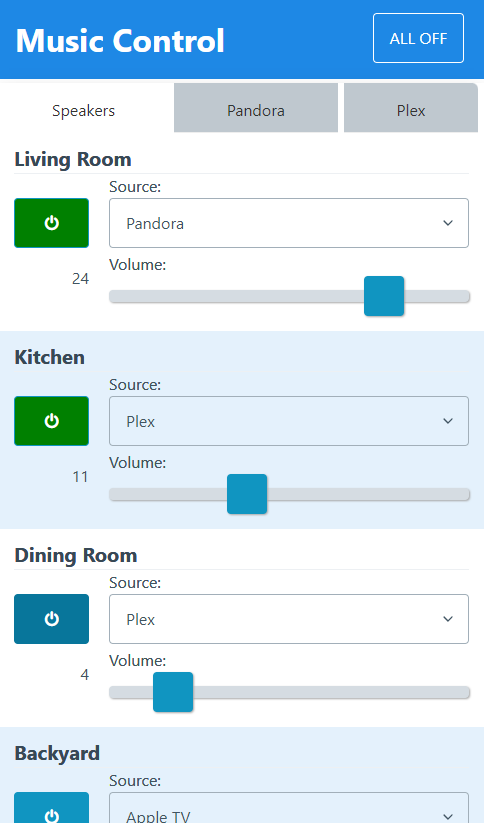
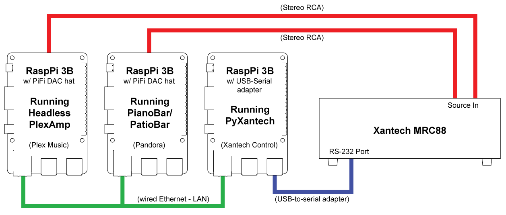

# pyxantech

### UPDATE 2023-10-25: now migrated to Python 3


A Raspberry Pi-ready Python/Flask controller for Xantech RS-232-capable multi-zone amplifiers

## What's a Xantech, anyway?
The MRAUDIO8X8M / MRC88 / MRC88CTL are eight-source, eight-zone distribution amplifiers produced by Xantech in the early-to-mid 2000's. They were installed in many nightclubs and high-end residential homes. The products were typically controlled by one or more wall-mounted keypads in each zone, which were programmed via Xantech's expensive (and somewhat clumbsy) *Dragon Drop* software which was a combined IDE and proprietary programming language. As wall-mounted keypads fell out-of-favor, and products like SONOS came on the market, these older Xantech products were cast aside despite their superior discreet amplifiers and multi-zone capabilities.

## So why spend any more ergs on them now?
Hidden on the back on the Xantech 8-zone amplifiers were seldom-used RS-232 ports which, together with a rudimentary communication protocol, could control almost every aspect of the Xantech's functionality. Today, we can reinvigorate these old products by controlling them through a Raspberry Pi (or possibly Arduino) connected to this serial port, using this Python Flask application that can present a web-based interface to any browser-capable mobile device or computer. With Xantech 8-zone amps available on eBay, occassionally for less than even $100, this makes the PyXantech system one of the more affordable options for whole-house audio distribution. Plus I just thought it would be fun to see what I could do.

## Features:
- Web-based, mobile-responsive controller interface
- Status syncs across all devices via web sockets
- Easy to configure zone and source names
- Control on/off, source and volume of each zone
- Xantech simulator included for testing*

(* see *Testing* below for more information)

## Requirements
- RS-232 capable Xantech amp (I use a MRC88, but the MRAUDIO8X8 should also work**)
- Raspberry Pi (I'm running a Pi 3B, but have been testing on Pi 4 with no issues), running:
  - Python (PyXantech updates support 3.9+)
  - Flask (http://flask.pocoo.org/)
  - flask_socketio (https://pypi.org/project/Flask-SocketIO/)
  - eventlet (optional, but recommended) (https://pypi.org/project/eventlet/)
  - PySerial (https://pythonhosted.org/pyserial/)
  - PyXantech (this project)
- USB-to-serial (9-pin RS-232) adapter/dongle (something like this https://www.amazon.com/Sabrent-Converter-Prolific-Chipset-CB-DB9P/dp/B00IDSM6BW/ref=sr_1_1_sspa)

(** - if you're looking to buy a Xantech amplifier specifically for this purpose, before purchase please be sure you research whether the particular product you want to buy has an RS-232 port and supports the Xantech Serial Communication Protocol (aka Xantech's "MRC88 RS232 'DIGITAL' INTERFACE"). BEWARE: products like the smaller 4-zone MRAUDIO4X4 and other Xantech 8-zone products are known to have the RS-232 port, but do *not* support the protocol. I can not be held responsible if you purchase the wrong product.)

## Set-up
- Install Raspberry Pi OS ***no Pi OS desktop needed***
  - Using the official Raspberry Pi Imager:
    - if you are on a Pi 3, choose *Raspberry Pi OS (Legacy) Lite* from the *Raspberry Pi OS Other* menu. I used the Bullseye version dated 2023-05-03.
    - if you are on a Pi 4, you can use the *Rapsberry Pi OS Lite (64-bit)* from the *Raspberry Pi OS Other* menu. I used the Bookworm version dated 2023-10-10.
  - Before flashing, bring up the advanced options using **Ctrl + Shift + X** and under *Service*, Enable SSH
  - Flash to a MicroSD card (32GB should be more than sufficient)
- Connect the Xantech serial port to any USB port on the Raspberry Pi using an adapter (see above)
  - (if you wish to run the app on a computer without a Xantech connected, see *Testing* below)
- Power on the Pi and connect it to the network (hard-wired is recommended)
- You will need some method to determine the IP address of your Raspberry Pi on your LAN.
  - if you have a router with a decent web UI, you should be able to open that and look for the Pi in the list of *Attached Devices* (or similar verbage)
  - you will also want to create an IP address **reservation** so you can always find PyXantech's web ui
- SSH into the Pi using a utility such as PuTTY connecting to the IP address you determined above
- Expand the Pi's filesystem using the Raspberry Pi Configurator utility
```
  pi@xantechpi:~ sudo raspi-config
```
  - the under *Advanced*, choose *Expand File System*
- Reboot the Pi
```
  pi@xantechpi:~ sudo reboot
```
- Update all the libraries to the latest
```
  pi@xantechpi:~ sudo apt-get update
  pi@xantechpi:~ sudo apt-get upgrade
```
- Reboot the Pi again
- Python 3.9+ should be installed by default in Raspbian. 
```
  pi@xantechpi:~ python -V
  Python 3.11.2
```
  - should return "Python 3.9" or greater
  - if not, you will need to install Python 3 (see online tutorials for "raspberry pi install python 3")
- Python3 PIP may need to be installed
```
  pi@xantechpi:~ pip -V
  bash: pip: command not found
```
  - if the system can not find PIP, or the version reported is not 3.x or greater, install Python3 PIP
```
  pi@xantechpi:~ sudo apt-get install python3-pip
```
- PIP may also need to be configured
```
  pi@xantechpi:~ pip install flask
  error: externally-managed-environment
```
  - if you choose to create a virtual environment (venv) on your Pi for PyXantech, here's where you would do that
  - I choose to run PyXantech outside of a virtual environment on the Pi, because I feel a venv would be overkill seeing that my Pi's sole purpose will only ever be controlling my Xantech amp. But as such, I need to tell PIP that I will not be using a venv
```
  pi@xantechpi:~ sudo mv /usr/lib/python3.11/EXTERNALLY-MANAGED /usr/lib/python3.11/EXTERNALLY-MANAGED.old
```
  - replacing the Python version with whatever version is currently installed
- Now install dependencies using the working PIP
```
  pi@xantechpi:~ pip install flask
  Successfully installed Jinja2-3.1.2 MarkupSafe-2.1.3 Werkzeug-3.0.0 blinker-1.6.3 click-8.1.7 flask-3.0.0 itsdangerous-2.1.2

  pi@xantechpi:~ pip install flask-socketio
  Successfully installed bidict-0.22.1 flask-socketio-5.3.6 h11-0.14.0 python-engineio-4.8.0 python-socketio-5.10.0 simple-websocket-1.0.0 wsproto-1.2.0

  ***(installing eventlet is optional, but recommended)***
  pi@xantechpi:~ pip install eventlet
  Successfully installed dnspython-2.4.2 eventlet-0.33.3 greenlet-3.0.0

  pi@xantechpi:~ pip install pyserial
  Successfully installed pyserial-3.5
```
- Install this project (either via GIT on the Pi, or download the ZIP and get it onto the Pi some other way)
- Edit config.json (see *Configuration* below)
  - this configuration file now combines the information for both the zones and the sources for the Xantech  
- Run the project
  - The project uses socketio.run(), so the typical `flask run` will likely cause issues. Use instead:
```
  pi@xantechpi:~ cd xantech
  pi@xantechpi:~ python app.py
```
- Open a web browser on a device on the same network as your Pi, and point it to port 5000 on the IP address of the Pi (for example: http://192.168.1.100:5000)
  - If you wish to control your Xantech from a device on *any* network (ie - your mobile data plan, or external computer), you'll need to set up dynamic DNS, firewall rules, etc... I'll leave that up to you.
- Click the power button for any zone, select a source, set the volume, and make sure everything is working as expected.
- Quit the app using **CTRL-C**

## Running as a service
- You're likely to want to run PyXantech as a system service so that it will launch as soon as the Pi is booted, will run unattended, and will even restart if it encounters issues
  - Included in the project is a .service file all set to use, assuming you installed the project to the */home/pi/xantech* directory on the Pi (default installation, from above)
  - Just copy the .service file to the systemd directory, and register it as a service
```
  pi@xantechpi:~ sudo cp xantech.service /lib/systemd/system/
  pi@xantechpi:~ sudo systemctl daemon-reload
  pi@xantechpi:~ sudo systemctl enable xantech
  pi@xantechpi:~ sudo systemctl start xantech
```
- You should now be able to point a web browser to the Pi's IP address, as above, and find the PyXantech interface (http://<*your pi's IP address*>:5000
- Test that it launches on system reboot
```
  pi@xantechpi:~ sudo reboot
```
  - wait a few minutes for the system to fully reboot, then try your web browser again
- Enjoy

## Configuration
- All configuration for the Xantech amp is now handled in a single JSON file (config.json) in the root directory of the project
- The JSON has two main branches - for Zones and Sources - and looks like this:
```
{
    "zones": [
        {"zone":1, "name":"Living Room", "enabled": true, "default_volumne": 5 },
        {"zone":2, "name":"", "enabled": false, "default_volumne": 5  },
        {"zone":3, "name":"Kitchen", "enabled": true, "default_volumne": 5  },
        {"zone":4, "name":"Dining Room", "enabled": true, "default_volumne": 5  },
        {"zone":5, "name":"Backyard", "enabled": true, "default_volumne": 5  },
        {"zone":6, "name":"", "enabled": false, "default_volumne": 5  },
        {"zone":7, "name":"", "enabled": false, "default_volumne": 5  },
        {"zone":8, "name":"", "enabled": false, "default_volumne": 5  }
    ],
    "sources": [
        {"source":1, "name":"Pandora", "enabled": true, "type": "streaming", "url":"http://xxx.xxx.xxx.xxx:3000/" },
        {"source":2, "name":"TiVO", "enabled": true, "type": "device" },
        {"source":3, "name":"Apple TV", "enabled": true, "type": "device" },
        {"source":4, "name":"CD Player", "enabled": true, "type": "device" },
        {"source":5, "name":"Plex", "enabled": true, "type": "streaming", "url":"http://xxx.xxx.xxx.xxx:32500/" },
        {"source":6, "name":"", "enabled": false, "type": "device" },
        {"source":7, "name":"", "enabled": false, "type": "device" },
        {"source":8, "name":"", "enabled": false, "type": "device" }
    ]
}
```
- Editing is relatively straight-forward, though care must be taken to ensure you maintain the formatting
  - for zones
    - enter a name for each the active zones connected the amp (this can be anything you like)
    - indicate whether the zone is *enabled* (should appear in the PyXantech interface) with a "true" or "false" value
    - setting a Default Volume level is option, and is not yet implemented
  - for sources
    - enter a name for each the active sources connected the amp (this can be anything you like)
    - indicate whether the source is *enabled* (should appear in the PyXantech interface) with a "true" or "false" value
    - indicate the type of source that is connected
      - "device" indicates it is a physical device that must be controlled via hardware buttons or remote control
      - "streaming" indicates it is a streaming source, that has a dedicated web-based UI (either local or online)
    - if the type is set to "streaming", include the URL of the web-based interface. This can be another device on your network (like another Raspberry Pi running PianoBar/PatioBar for Pandora stations, or headless PlexAmp for your Plex audio media - see more below)
- save to config.json file with any changes, and relaunch the app

- For reference, here is my current setup:
  - I have three dedicated Raspberry Pi 3B's
    - 1 Pi running PyXantech to control the Xantech amp
    - 1 Pi - with a PiFi Hi-Res DAC hat - running PianoBar/PatioBar to play my Pandora stations
    - 1 Pi - with a PiFi Hi-Res DAC hat - running a headless install of PlexAmp to play the music in my local Plex music library, as well as the other streaming radio stations Plex provides
   


## Testing
Included with the PyXantech project is a Xantech serial simulator. This allows the project to run (test) even if the Xantech amplifier is not connected (even on non-Pi computers)
- edit *app.py* and change
```
  ACTIVE_SERIAL=True
```
to
```
  ACTIVE_SERIAL=False
```
- configure source and zones, and run app as above
    
    

 


