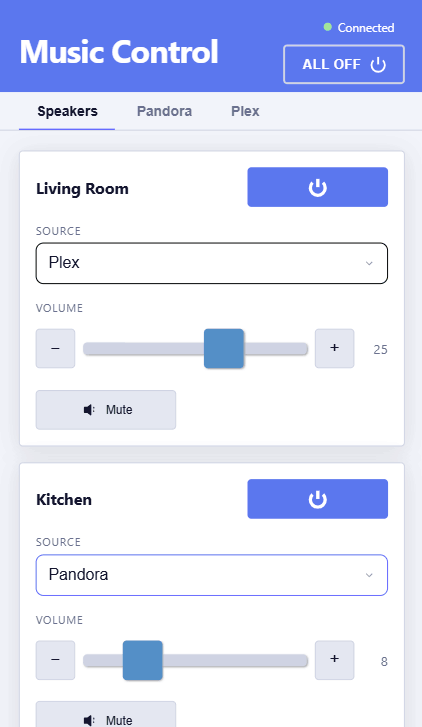
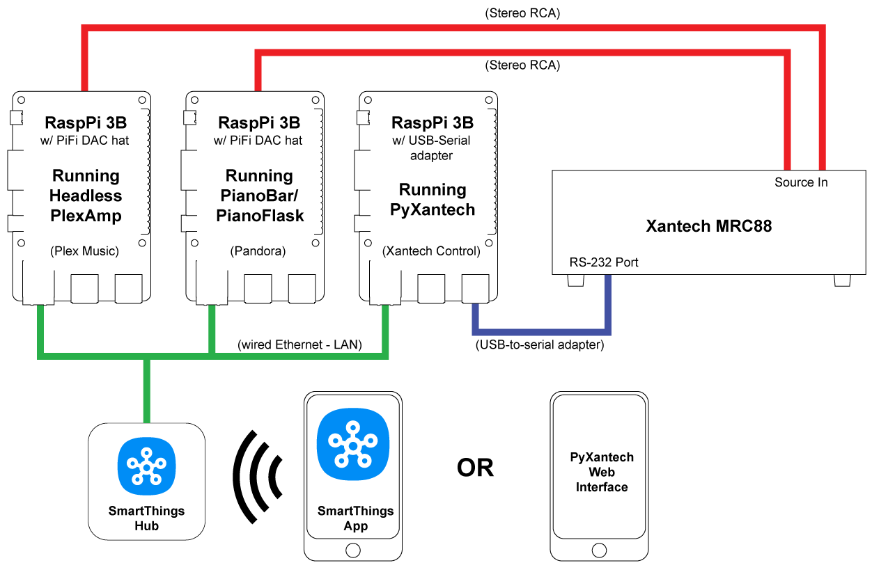

# PyXantech



A Raspberry Pi-ready Python/Flask-based, web- and LAN-enabled controller for Xantech RS-232-capable multi-zone/multi-source audio amplifiers

[UPDATE 2026-07-15: major new release](#update-2026-07-15-major-new-release)

[What's a Xantech, anyway?](#whats-a-xantech-anyway)

[So why spend any more ergs on them now?](#so-why-spend-any-more-ergs-on-them-now)

[Features](#features)

[Requirements](#requirements)

[Set-up](#set-up)

[Running as a service](#running-as-a-service)

[Configuration](#configuration)

[Sending commands on URL](#sending-commands-on-url)

[Theming](#theming)

[How to put it all together](#how-to-put-it-all-together)

[Testing](#testing)

[Change Log](#change-log)

<br clear="all" />


### UPDATE 2026-07-15: major new release

This release is a complete refactoring of the code base. I developed this new version from the ground up, with the prevailing model that the "web UI becomes the one source of truth for all the device settings". [^1]

Features added:
- the controls for a zone are now fully active, even when the zone is off (can select source and volume prior to turning the zone on, etc)
- turning a zone on assumes you want to hear music NOW, and will nudge controllable sources awake and beging playing
- added increment and decrement buttons to allow for finer volume control
- re-architected the REST routes to be more robust and compatible with SmartThings and other home automation, and be more standard in their protocol and behavior.
- added a custom SSDP broadcaster to make PyXantech auto-discoverable in SmartThings (and maybe other automation platforms)
- added rudimentary theming (see [Theming](#theming) below)
- reworked Pianobar and PlexAmp control to be fully onboard the app, rather than an iframe cheat
- the simulator (now built directly into the Xantech class) is toggled automatically based on connectivity
- moved integrations to legitimate Xantech and Streaming classes for better maintainability
- updated the URL/REST endpoints to be full service, supporting PUT and GET to use either JSON payloads or query parameters to set or retrieve zone values
- cleaned up release packages to include requirements.txt and control.json.template

Bugs fixed:
- source lists no longer randomly appear empty
- "streaming" sources, such as Plex (PlexAmp) and Pandora (Pianobar), no longer vanish
- reworked the websockets to use threading, rather than the troublesome (and deprecated) monkeypatched eventlet


## What's a Xantech, anyway?
The MRAUDIO8X8M / MRC88 / MRC88CTL are eight-source, eight-zone distribution amplifiers produced by Xantech in the early-to-mid 2000's. They were installed in many nightclubs and high-end residential homes. The products were typically controlled by one or more wall-mounted keypads in each zone, which were programmed via Xantech's expensive (and somewhat clumbsy) *Dragon Drop* software which was a combined IDE and proprietary programming language. As wall-mounted keypads fell out-of-favor, and products like SONOS came on the market, these older Xantech products were cast aside despite their superior discreet amplifiers and multi-zone capabilities.

## So why spend any more ergs on them now?
Hidden on the back of the Xantech 8-zone amplifiers were seldom-used RS-232 ports which, together with a rudimentary communication protocol, could control almost every aspect of the Xantech's functionality. Today, we can reinvigorate these old products by controlling them through a Raspberry Pi (or possibly Arduino) connected to this serial port, using this Python Flask application that can present a web-based interface to any browser-capable mobile device or computer. With Xantech 8-zone amps available on eBay, occassionally for even less than $100, this makes the PyXantech system one of the more affordable options for whole-house audio distribution. Plus I just thought it would be fun to see what I could do.

---

## Features:
- Web-based, mobile-responsive controller interface
- Status syncs across all client devices via web sockets
- Easy to configure zone and source names
- Control on/off, source, volume and now muting of each zone
- Provide REST-like endpoints that allow control and status updates via IFTT, SmartThings, Home Assistant or other utilities capable of making POST/PUT/GET calls to a URL.
- Works alongside my other GitHub projects, such as [PianoFlask](https://github.com/carlsteinhilber/pianoflask) and my SmartThings Edge Drivers for [Xantech](https://github.com/carlsteinhilber/xantech-edge-driver) and [PlexAmp](https://github.com/carlsteinhilber/plex-edge-driver).

---

## Requirements
- **RS-232 capable Xantech amp** (I use a MRC88, but the MRAUDIO8X8 should also work)[^1]
- **Raspberry Pi**[^2] (I'm running a Raspberry Pi 3B, but have been testing on Pi 4 with no issues), running:
  - **Python 3** (PyXantech supports 3.9+)
  - **Flask** (http://flask.pocoo.org/)
  - **flask_socketio** (https://pypi.org/project/Flask-SocketIO/)
  - **PySerial** (https://pythonhosted.org/pyserial/)
  - standard setuptools and requests Python libraries
  - **PyXantech** (this project)
- **USB-to-serial (9-pin RS-232) adapter/dongle** (something like this https://www.amazon.com/Sabrent-Converter-Prolific-Chipset-CB-DB9P/dp/B00IDSM6BW/ref=sr_1_1_sspa)

<small>[^1] if you're looking to buy a Xantech amplifier specifically for this purpose, before purchase please be sure you research whether the particular product you want to buy has an RS-232 port and supports the Xantech Serial Communication Protocol (aka Xantech's "MRC88 RS232 'DIGITAL' INTERFACE"). BEWARE: products like the smaller 4-zone MRAUDIO4X4 and other Xantech 8-zone products are known to have the RS-232 port, but do *not* support the protocol. I can not be held responsible if you purchase the wrong product.</small>

<small>[^2] while this project, and my personal ecosystem, is built on Raspberry Pis, realistically there should be no reason why it can't be implemented on other platforms such as mini-PCs or NUCs, or WiiM devices. However, I will leave any translation required from a Raspberry Pi to whatever systems you may decide to use up to you.</small>
---

## Set-up

### 1. Install the Raspberry Pi operating system

Install Raspberry Pi OS ***no Pi OS desktop needed***
- Using the official Raspberry Pi Imager choose a standard Raspberry Pi OS:
  - if you are planning to dedicate the Pi to running PyXantech and nothing else (recommended), select the "Other" option and choose the "Lite" version OS (without a desktop).
  - if you are using a Pi 4, you can choose the 64-bit version.
- Before flashing, click on the Advanced options (if running an older version of the imager, press **Ctrl + Shift + X** on your keyboard)
  - under *Service*, Enable SSH
  - if you're connecting your Pi via WiFi, enter your SSID and wifi credentials
- Flash to a MicroSD card (32GB should be more than sufficient)

### 2. Connect the Pi

Connect the Xantech amplifier's serial port to any USB port on the Raspberry Pi using an adapter (see [Requirements](#requirements) above)

Power on the Pi and connect it to the network (hard-wired is recommended)

### 3. Configure the Pi

You will need some method to determine the IP address of your Raspberry Pi on your LAN.
- if you have a router with a decent web UI, you should be able to open that and look for the Pi in the list of *Attached Devices* (or similar verbage)
- you will also want to create an IP address **reservation** so you can always find PyXantech's web ui (if you're unsure how to do this, read the documentation for your particular router, or ask Google)

SSH into the Pi - using a utility such as **PuTTY** - connecting to the IP address you determined above

Expand the Pi's filesystem using the Raspberry Pi Configurator utility
```bash
sudo raspi-config
```
- the under **Advanced**, choose **Expand File System**

Reboot the Pi
```bash
sudo reboot
```

Once the Pi has rebooted and is accessible again on the network, SSH again via PuTTy

Update all the libraries to the latest
```bash
sudo apt-get update && sudo apt-get upgrade
```

Reboot the Pi again, and SSH

Check your **Python** version
```bash
python -V
```
   - if it returns `python: command not found` or if the version is less than 3.9, you'll want to install/update Python 3 (see online tutorials for "raspberry pi install python 3")

Check your Python **PIP** version
```bash
pip -V
```
  - if the system can not find PIP (`pip: command not found`), or the version reported is not 3.x or greater, install Python3 PIP
```bash
sudo apt-get install python3-pip
```

Attempt to install **Flask**
```bash
pip install flask
```
  - if pip responds with `error: externally-managed-environment`
  - if you choose to create a virtual environment (venv) on your Pi for PyXantech, here's where you would do that
  - I chose to run PyXantech outside of a virtual environment on the Pi, because I feel a venv would be overkill seeing that my Pi's sole purpose will only ever be controlling my Xantech amp. But as such, I need to tell PIP that I will not be using a venv
```bash
sudo mv /usr/lib/python3.11/EXTERNALLY-MANAGED /usr/lib/python3.11/EXTERNALLY-MANAGED.old
```
  - replacing the Python version with whatever version is currently installed


Now install dependencies using the working PIP
```bash
pip install -r requirements.txt
```

Make sure the .local/bin directory is in the system PATH
```bash
export PATH="$HOME/.local/bin:$PATH"
```

### 4. Install PyXantech

Install this project into a subdirectory under /home/pi named "pyxantech" (either via GIT on the Pi, or download the ZIP and get it onto the Pi some other way)
```bash
sudo apt-get install git

sudo git clone https://github.com/carlsteinhilber/pyxantech.git
```

PyXantech should now be installed, and ready to be configured for your particular setup

### 4. Configure PyXantech

Create **config.json** (see [Configuration](#configuration) below)
  - this configuration file combines the information for both the zones and the sources for the Xantech amplifier 
  - as of 2024-07-15 build, it also now includes system settings (*IMPORTANT!* if you are updating an existing installation, be sure to copy and edit the "system" node from the new config.json.template to your existing config.json file)

Run the project
  - The project uses socketio.run(), so the typical `flask run` will likely cause issues. Use instead:
```bash
cd pyxantech
python app.py
```

### 5. Test PyXantech control

Open a web browser on a device on the same network as your Pi, and point it to port 5000 on the IP address of the Pi (for example: http://192.168.1.20:5000)
  - the port number is definable in the config.json, but defaults to 5000
  - If you wish to control your Xantech from a device on *any* network (ie - your mobile data plan, or external computer), you'll need to set up dynamic DNS, firewall rules, tailscale, etc... I'll leave that up to you.

Click the power button for any zone, select a source, set the volume, and make sure everything is working as expected.

Quit the app using **CTRL-C**

---

## Running as a service

You'll likely want to run PyXantech as a system service so that it will launch as soon as the Pi is booted, will run unattended, and will even restart if it encounters issues

  - Included in the project is a .service file all set to use, assuming you installed the project to the `/home/pi/pyxantech` directory on the Pi (default installation, from above)
  - Just copy the .service file to the systemd directory, and register it as a service
```bash
sudo cp xantech.service /lib/systemd/system/
sudo systemctl daemon-reload
sudo systemctl enable xantech
sudo systemctl start xantech
```

You should now be able to point a web browser to the Pi's IP address, as above, and find the PyXantech interface (`http://<*your pi's IP address*>:5000`)

Test that it launches on system reboot
```bash
sudo reboot
```
  - wait a few minutes for the system to fully reboot, then try your web browser again

Enjoy

---

## Configuration

All configuration for the Xantech amp is now handled in a single JSON file in the root directory of the project

In order for your configuration not to be shared or overwriten during Git pushes or pulls, the template for this configuration file is provided in the project as config.json.template. Simply rename this template as `config.json` to begin.
```bash
cp config.json.template config.json
```
  - be sure to always edit your new copy of the config.json file, rather than the template

The config file JSON has four main branches - for System, Zones. Sources, and a special branch for Plex - and looks like this:
```json
{
    "system":{
        "serialport":"ttyUSB0",
        "webuiport":5000,
        "usesimulator": false,
        "debugging": true,
        "appname": "Music Control",
        "theme": "light"
    },
    "plex": {
        "ip_address": "192.168.1.xxx",
        "port": 32400,
        "token": "<your Plex Media Server token>",
        "machine_identifier": "<your PMS machine ID>",
        "default_playlist_id": ""
    },
    "zones": [
        {"zone":1, "name":"Living Room", "enabled": true, "default_volume": 5 },
        {"zone":2, "name":"", "enabled": false, "default_volume": 5  },
        {"zone":3, "name":"Kitchen", "enabled": true, "default_volume": 5  },
        {"zone":4, "name":"Dining Room", "enabled": true, "default_volume": 5  },
        {"zone":5, "name":"Backyard", "enabled": true, "default_volume": 5  },
        {"zone":6, "name":"", "enabled": false, "default_volume": 5  },
        {"zone":7, "name":"", "enabled": false, "default_volume": 5  },
        {"zone":8, "name":"", "enabled": false, "default_volume": 5  }
    ],
    "sources": [
        {"source":1, "name":"Pandora", "enabled": true, "type": "streaming", "url":"http://192.168.1.xxx:5000/", "usesimulator": false },
        {"source":2, "name":"TiVO", "enabled": true, "type": "device" },
        {"source":3, "name":"Apple TV", "enabled": true, "type": "device" },
        {"source":4, "name":"CD Player", "enabled": true, "type": "device" },
        {"source":5, "name":"Plex", "enabled": true, "type": "streaming", "url":"http://192.168.1.xxx:32500/", "usesimulator": false },
        {"source":6, "name":"", "enabled": false, "type": "device" },
        {"source":7, "name":"", "enabled": false, "type": "device" },
        {"source":8, "name":"", "enabled": false, "type": "device" }
    ]
}

```

Editing is relatively straight-forward, though care must be taken to ensure you maintain the formatting

`system`
  - `serialport`: enter the name of the serial port connected to the Xantech amplifier (typically for a Pi, it will be `"ttyUSB0"`)
  - `webuiport`: [optional] enter the port number to use for the PyXantech web interface (default is `5000`)
  - `usesimulator`: [optional] true/false - whether or not to force PyXantech to use the device simulator, if you're not yet connected to a physical amplifier
  - `debugging`: [optional] true/false - whether to output debugging info to STDOUT
  - `appname`: [optional] give your PyXantech a nice name (appears in the header of the page and page title in your browser, ex: "Music Control")
  - `theme`: [optional] select a theme for the interface (see [Theming](#theming) below)

`zones`
  - a zone consists of a pair of speakers. For each zone, specify:
    - `zone`: the number of the zone, corresponding to the output on the Xantech amplifier (1-8)
    - `name`: the friendly name of your zone (anything you like, ex: `"Living Room"`)
    - `enabled`: true\false - whether or not the zone should appear in the interface (ie: are there speakers attached to this zone)
    - `default_volume`: define the default volume for the zone. This will only be used if the system ever restarts, otherwise zones will always use the last volume set

`sources`  
  - a source is any audio output device you connect to the inputs of the Xantech. For each source, specify:
    - `source`: the number of the source, corresponding to the input on the Xantech amplifier (1-8)
    - `name`: the friendly name of your source (anything you like, ex: `"Pandora"`)
    - `enabled`: true\false - whether or not the source should appear in the interface (ie: is a device attached to this input)
    - `type`: define the type of device:
      - `"device"` if it's a physical device like a CD Player or set-top box (that PyXantech can not control directly)
      - `"streaming"` if it's a virtual device like PlexAmp or PianoBar that PyXantech *can* control
        - if you've designated a streaming device, there are two additional settings required:
          - `"url"`: the URL of the virtual device (typically an IP and port number, ex: `"http://192.168.1.20:5000/"` for a PianoFlask Pi). This can be another device on your network (like another Raspberry Pi running PianoBar/PatioBar for Pandora stations, or headless PlexAmp for your Plex audio media - see more below)
          - `"usesimulator"`: true/false - whether or not the system should simulate a connection to the virtual device, in case you don't have it set up yet

`plex`
  - the plex branch is only required if you are connecting a Plex client (usually a headless PlexAmp installation running on another Raspberry Pi) as one of the Xantech sources
    - `ip_address`: the IP address of your *Plex Media Server* (not the client)
    - `port`: the port number for the web interface (Desktop UI) of your Plex Media Server (typically `32400`),
    - `token`: your Plex Media Server API token (see *Plex Info* below)
    - `machine_identifier`: your Plex Media Server machine ID (see *Plex Info* below)
    - `default_playlist_id`: the ID of the playlist you want the Plex stream to select should the system restart, otherwise the Plex source will always use the last playlist selected

save the config.json file with any changes, and relaunch the app
```bash
sudo systemctl restart xantech
```

---

## Sending commands on URL
The PyXantech Pi can receive commands via URL, similar to a REST endpoint, useful for implementing IFTTT handlers or other external processes capable of posting data to the Pi. This functionality was introduced in an earlier update, but has been significantly enhanced, and thus the base URL has changed and behaves a bit differently.

The base URL is now `http://<the IP or URI of the PyXantech Pi>/api/zones`

### Retrieving zone states

The base URL accepts a PUT or a GET with no parameters or payload, and returns the state of all enabled zones (only zones with `"enabled":true` setting in config.json)

Ex:
`http://192.168.1.xxx/api/zones`

```json
{
    "1": {"power": true, "volume": 20, "source": 5, "mute": false, "name": "Living Room"},
    "3": {"power": false, "volume": 10, "source": 1, "mute": false, "name": "Kitchen"},
    "4": {"power": false, "volume": 5, "source": 1, "mute": false, "name": "Dining Room"},
    "5": {"power": false, "volume": 5, "source": 1, "mute": false, "name": "Backyard"}
}
```

You can also retrieve the state of a specific zone, by adding the zone number to the base URL
Ex:
`http://192.168.1.xxx/api/zones/3`

```json
{
    "power": false,
    "volume": 10,
    "source": 1,
    "mute": false,
    "name": "Kitchen"
}
```
(will only return a zone status if it is enabled, otherwise it will return a 404 with error message `{"error": "zone 3 not found or not enabled"}`)


### Setting zone states

Add the zone number and "set" command to the base URL to set the state of a zone. The "set" command can accept either a PUT with a JSON payload defining the desired settings, or a GET with query string parameters.

Ex:

`PUT http://192.168.1.xxx/api/zones/3/set`

with a request payload of

```json
{
  "power": true, 
  "source": "Plex", 
  "volume": 20
}
```
will power on zone 3, set it's source to "Plex", and set it's volume to 20

OR

`PUT http://192.168.1.xxx/api/zones/3/set?power=1&source=5&volume=20`

will do the same thing.


Parameters in both the JSON and query string can be numerical or case-insensitive strings.

Ex:

```json
"power":true
"power":"on"
"power":1
"power":"yes"
```
will all turn the power on for a zone.
Likewise

```json
"source":5
"source":"Plex"
"source":"plex"
```
will all set a zone's source to Plex (assuming source 5 has the name "Plex" in config.json)

Attempting to set a string value that can not be mapped will result in a 400 response with descriptive message:
```json
{"error": "Invalid source 'Plexx' — use a number (1-8) or a name from config.json"}
{"error": "Invalid volume 'loud' — must be an integer 0-38"}
```

### Special zone state

There is one special zone state, elevated to a single command:

`http://192.168.1.xxx/api/zones/off`

will power off all zones.


### Streaming URLS

The Flask app also has a separate set of URLs for interacting with streaming devices, such as PianoFlask and PlexAmp. Though, full disclosure, after I added them to the app I decided that it's usually better to interact with those devices directly, rather than having PyXantech act as a sort of broker or middleman. However, I left the routes in the app just for the sake of completeness, and because they connect to internal commands that PyXantech uses behind-the-scenes anyway.

Those URLs are:

`/api/streaming/<source_id>/status`: returns the status of a source.

So the status response example for a Plex source would be:

```json
{
    "available": true,
    "title": "Mad World",
    "artist": "Gary Jules",
    "album": "Trading Snakeoil for Wolftickets",
    "playing": true,
    "album_art": "http://xxx.xxx.xxx.xxx:32400/library/metadata/12345/thumb/67890?X-Plex-Token=s9dsXx...",
    "duration_ms": 203000,
    "position_ms": 45000,
    "player_state": "playing",
    "player_name": "PlexPi",
    "current_playlist_id": "521354"
}
```

`POST /api/streaming/<source_id>/play`: begins playback of the specified source

`POST /api/streaming/<source_id>/pause`: pauses playback of the specified source

`POST /api/streaming/<source_id>/next`: skips playback of the specified source to the next track

`POST /api/streaming/<source_id>/prev`: skips playback of the specified source to the previous track

`/api/streaming/<source_id>/playlists`: retrieves the list of playlists for the source

`POST /api/streaming/<source_id>/playlists`: sets the playlist for the source

So posting `http://192.168.1.xxx/api/streaming/5/playlists` with a JSON payload of
```json
{
    "id": 12345,
}
```
would change the playlist for the Plex source to whatever playlist has an ID of 12345.

---
## Theming

Theming for the PyXantech web interface is simply a single CSS file, defining the delta styles between the default dark theme and whatever theme you want.

Ex:
Create a `red_theme.css` file in `static/styles/themes` directory
```css
:root {
  --bg:       #ff0000;
  --surface:  #ff0000;
  --surface2: #ff0000;
  --border:   #cbd5e1;
  --text:     #ffffff;
  --muted:    #64748b;
  --shadow:   0 4px 24px rgba(0,0,0,.10);
}
```

then change the theme in the `system` branch of the config.json. The value specified will simply be the base name of the .css file (without the .css file extension)
```json
{
    "system":{
          :
        "theme": "red_theme"
    },
      :
      :
}
```

Restart the app
```bash
sudo systemctl restart xantech
```
and your new theme is active.

The default theme is `"dark"`, but alternatives are included in the project for
  - `"light"`
  - and `"original"`, which is a recreation of the interface from previous versions of PyXantech
  
Feel free to code your own themes!

---

## How to put it all together

- For reference, here is my current setup:
  - I have three dedicated Raspberry Pi 3B's
    - 1 Pi running PyXantech to control the Xantech amp
    - 1 Pi - with a PiFi Hi-Res DAC hat - now running PianoBar and my custom Flask PianoBar UI ***PianoFlask***, available here: https://github.com/carlsteinhilber/pianoflask
    - 1 Pi - with a PiFi Hi-Res DAC hat - running a headless install of PlexAmp to play the music in my local Plex music library, as well as the other streaming radio stations Plex provides (this page gives you a great step-by-step guide to setting up PlexAmp on your Raspberry Pi: https://howtohifi.com/install-headless-plexamp-endpoint-home-network-raspberry-pi/)
  - Each Pi has a dedicated IP address, that I have added to the config.json for PyXantech, so I only have to go to the PyXantech interface to control everything
  - I have also written a [custom PyXantech Edge Driver for SmartThings](https://github.com/carlsteinhilber/xantech-edge-driver), so I can control some of the aspects of my zones from my SmartThings app/hub; power on/off, volume, source selection, and muting. Since SmartThings integrates automatically with Google Assistant/Gemini and Siri, this also means I finally have voice control over the Xantech ("Hey Google, turn on the Kitchen Speakers") and because of the inbuilt "nudging" of the streaming sources, I'll hear music right away.
  - And finally, I've written a [custom PlexAmp Edge Driver for SmartThings](https://github.com/carlsteinhilber/plex-edge-driver) to control the headless PlexAmp instance from the SmartThings app, allowing it to be addressed in routines and schedules.
   


---

## Testing
Built into the Python Xantech class is a Xantech simulator. This allows the project to run (test) even if the Xantech amplifier is not connected (even on non-Pi computers)
- edit *config.json* and change
```json
    "usesimulator": false
```
to
```json
    "usesimulator": true
```
in the `system` settings.

The Streaming class has a similar simulation mode, which allows testing of the streaming sources, even if they are not connected or accessible on the network. It is configurable on a per-source basis by editing *config.json* and updating
```json
  "source":1, "name":"Pandora", "usesimulator": false ... 
```
to
```json
  "source":1, "name":"Pandora", "usesimulator": true ... 
```
in the "sources" settings.[^1]


Also included is a small testing app - *testing_xantech.py*, which sends vanilla commands to the Xantech amplifier and prints out any responses. This may be helpful to run early on during your setup to ensure your Pi is communicating properly with the Xantech amp.

You can run it with
```bash
python testing-xantech.py --logfile xantech-test.log

```    
and it will save the output to the log file specified.

---
## Using Plex

One of priority use cases for me has been playing my own personal media from my self-hosting Plex Media Server. I have a good-sized library of music I've ripped from tons of CDs, and I wanted to play it through-out the house, without any ads or interuptions.

The Plex devs have created a nice client - called PlexAmp - specifically for playing music/audio, and have released it as a stand-alone app that can run headless on a Raspberry Pi. So I knew interfacing with PlexAmp was crucial to PyXantech. It turns out, PlexAmp is relatively easy to control remotely, via HTTP commands. The key is determining some special tokens for your Plex Media Server and PlexAmp installations, but these tokens are traditionally hidden and not always easy to get.

To that end, I've included a very small script named `plex_info.py` that will attempt to grab the tokens for you so you can easily add them to config.json.

Simply run the script
```bash
python plex_info.py

```    
the script will report back both the `token` and `machine_identifier`, and then output a list of playlists with IDs ready to plug into the `default_playlist_id` setting in config.json


---
## Change Log
UPDATE 2026-07-16:
- refactoring

UPDATE 2024-07-15:
- new URL/REST-like command features
- new format for config.json

UPDATE 2023-10-25: 
- migrated to Python 3
- moved/forked from my original [deprecated] github account (@grandexperiments)

2019-03-25:
- Initial release


---

## License

MIT


